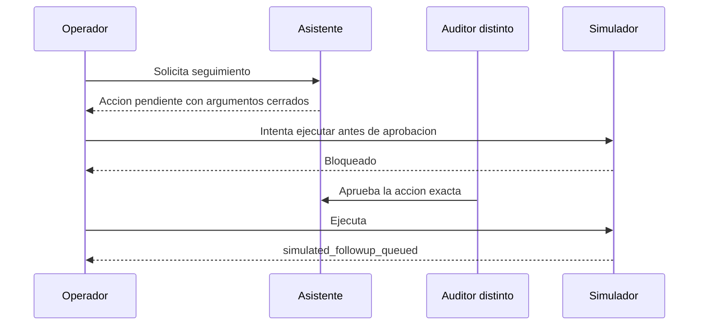

# Contrato del agente controlado

## Explicacion para un cliente no tecnico

El asistente no recibe permiso para actuar libremente. Funciona como un empleado que prepara una
orden: propone exactamente que quiere hacer, deja la orden pendiente y espera la firma de otra
persona. Solo despues de esa firma la aplicacion permite una ejecucion, que en este proyecto sigue
siendo simulada.

## Unica herramienta permitida

`send_customer_followup` solo acepta:

- `customer_reference`: referencia opaca `CUST-...`, no email ni nombre;
- `template`: `case_update`, `information_request` o `resolution_notice`;
- `reason`: `status_update`, `information_requested` o `case_resolved`.

No acepta texto libre de mensaje, destinatario arbitrario, URL, credencial o propiedades extras.
Este repositorio no implementa un conector de correo, CRM o mensajeria.

## Fronteras HTTP

- `POST /v1/assistant/action-plans`: operador; crea una solicitud `pending`.
- `POST /v1/actions/{id}/approve`: auditor; exige una identidad distinta del solicitante.
- `POST /v1/actions/{id}/execute`: operador; solo acepta estado `approved`.
- `GET /v1/actions/{id}`: visible al solicitante o a un auditor.

Ejecutar dos veces devuelve el mismo registro ejecutado y no crea otro evento. Aprobar o ejecutar en
un estado incompatible devuelve conflicto. Una accion inexistente no revela informacion.

## Tool calling con OpenAI

Produccion usa Responses API con una sola funcion, JSON Schema estricto,
`additionalProperties=false`, llamada obligatoria, `parallel_tool_calls=false` y `store=False`. El
modelo solo propone argumentos; el adaptador nunca invoca la herramienta. La instruccion no se
guarda en la solicitud ni en auditoria.

Fuentes oficiales aplicadas:

- <https://developers.openai.com/api/docs/guides/function-calling>
- <https://developers.openai.com/api/reference/resources/responses/methods/create>

## Auditoria

`action_requests` conserva el estado y los argumentos cerrados. `action_audit_events` añade eventos
`proposed`, `approved` y `executed` con identidad protegida por hash y el mismo SHA-256 de argumentos.
Así se puede demostrar quien aprobo exactamente que, sin guardar la instruccion original.

## Controles de costo y continuidad

- `ACTION_RATE_LIMIT_PER_MINUTE` bloquea propuestas antes de llamar al planificador.
- `AI_REQUEST_RATE_LIMIT_PER_MINUTE` limita respuestas RAG por sujeto.
- `AI_DAILY_TOKEN_BUDGET` bloquea nuevas generaciones al alcanzar el consumo diario registrado.
- `RAG_CACHE_TTL_SECONDS` reutiliza respuestas por sujeto y configuracion; antes de servir una
  respuesta cacheada revalida que cada cita siga activa y autorizada.
- `RAG_DEGRADED_EXTRACTIVE=true` permite una respuesta extractiva con estado `degraded` si OpenAI no
  responde. Si no hay evidencia, se rechaza; si se desactiva el fallback, el fallo es HTTP 503.

La tabla de cache contiene respuestas durante el TTL y requiere cifrado en reposo, backups protegidos
y una politica de retencion del cliente. Revocar un permiso invalida el uso de una cita cacheada.

## Limites honestos

- La ejecucion es una simulacion local; no se envio ningun seguimiento real.
- No hubo llamada viva de tool calling por ausencia de credencial de OpenAI.
- El parser local valida estados y contratos, pero no representa razonamiento de un modelo.
- Un cliente debe definir roles, identidad, retencion, limites y el conector final antes de permitir
  una accion real.
