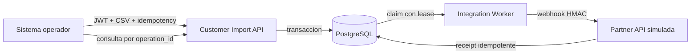
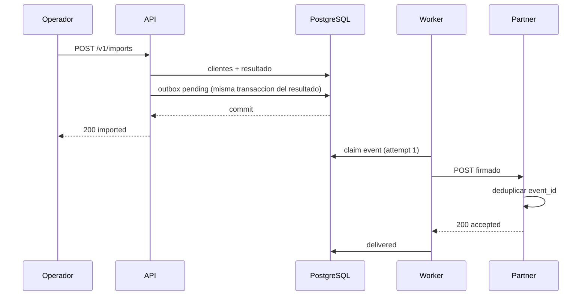
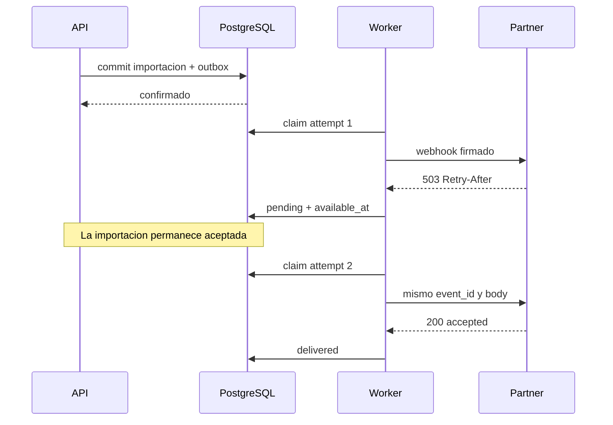

# Arquitectura y decisiones de integracion

## Diagrama de contenedores

El uso de PostgreSQL para receipts pertenece exclusivamente al simulador local. Un socio real es
dueno de su almacenamiento; no comparte credenciales ni tablas con la API principal.

## Secuencia correcta

## Secuencia con fallo parcial

## ADR-004 — Transactional outbox

Decision: persistir el evento junto al resultado y entregarlo con un worker. Se descarto llamar al
socio dentro de `POST /v1/imports` porque un timeout despues del commit haria imposible responder
con certeza al operador.

Consecuencia: existe consistencia eventual y operacion adicional, pero no hay ventana entre
"importacion confirmada" y "evento olvidado".

## ADR-005 — At-least-once con receptor idempotente

Decision: aceptar duplicados de transporte y eliminarlos por `event_id`. Se descarto afirmar
exactly-once: no existe una transaccion distribuida entre el emisor y el socio.

Consecuencia: el contrato del receptor debe conservar receipts y rechazar el mismo ID con otro
body.

## ADR-006 — Payload minimo sin PII

Decision: enviar solo metadatos operacionales hasta que el cliente apruebe un contrato de datos.

Consecuencia: este incremento notifica cambios incrementalmente, pero no replica perfiles. Una
integracion CRM real requiere descubrimiento adicional y controles de privacidad.

## Riesgos vigentes

| Riesgo | Mitigacion actual | Siguiente control |
|---|---|---|
| Secreto HMAC comprometido | Minimo 32 caracteres, fuera de imagen y logs | Gestor de secretos y rotacion dual |
| Backlog crece | Estados, `available_at` y dead letter observables | Metricas, alerta y autoscaling |
| Relojes desalineados | Ventana de cinco minutos | NTP y alerta de clock skew |
| Evento incompatible | `schema_version=1.0` y contrato estricto | Compatibilidad por version |
| Socio procesa y respuesta se pierde | Receipt idempotente | Retencion y backup del socio |
| PII compartida sin aprobacion | Payload minimo | DPA, minimizacion y field mapping |
