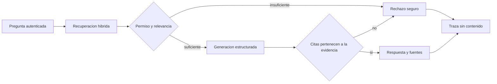

# Contrato del asistente RAG seguro

## Promesa al usuario

`POST /v1/assistant/answers` responde una pregunta solo cuando encuentra evidencia autorizada y
relevante. Una respuesta aprobada incluye al menos una cita estructurada con documento, URI y
fragmento. Si no puede demostrar el soporte, devuelve una negativa estable y ninguna cita.

## Flujo de confianza

## Reglas que no dependen del modelo

- El sujeto se obtiene del JWT; el cuerpo no puede elegir otra identidad.
- PostgreSQL aplica permisos antes de producir candidatos.
- El umbral acepta coincidencia lexical positiva o similitud coseno minima de `0.35`.
- Todo `chunk_id` citado debe existir en el conjunto autorizado enviado al generador.
- Una salida sin soporte, sin citas o con una cita inventada se reemplaza por rechazo seguro.
- La cita publica identifica la fuente pero no repite el contenido del fragmento.

## Frontera con OpenAI

El adaptador usa Responses API con salida Pydantic `GroundedDraft`, `store=False`, prompt versionado
y metadata sin pregunta. La pregunta y cada `evidence.content` se serializan como datos no
confiables; las instrucciones establecen que el modelo no debe obedecer texto incrustado en los
documentos ni usar conocimiento externo.

La seleccion actual configurable es `gpt-5.6-sol`. Una instalacion debe evaluar el modelo y los
precios vigentes antes de produccion; el repositorio no inventa costos cuando faltan tarifas.

Fuentes oficiales aplicadas:

- <https://developers.openai.com/api/docs/guides/prompt-guidance-gpt-5p6>
- <https://developers.openai.com/api/docs/guides/structured-outputs>
- <https://developers.openai.com/api/reference/resources/responses/methods/create>

## Trazabilidad privada

`rag_traces` conserva UUID de solicitud, hashes protegidos del sujeto y pregunta, estado, proveedor,
modelo, version del prompt, latencia, tokens, costo opcional y conteos. No tiene columnas para
pregunta, respuesta, sujeto original o contenido documental.

La tabla `rag_cache` queda preparada para el control de costo del Incremento 5. Cualquier entrada
estara separada por hash de sujeto y tendra vencimiento; este incremento no afirma que el cache ya
este activo.

## Adaptador determinista

Pruebas y desarrollo pueden seleccionar `ANSWER_PROVIDER=deterministic_local`. Es un extractor de
la primera oracion del fragmento mejor clasificado, cuesta cero y permite pruebas reproducibles. No
es un LLM ni demuestra calidad generativa.

## Fallos y limites

- Sin evidencia: HTTP 200 con `status=refused`; esto es un resultado empresarial esperado.
- Proveedor inaccesible: HTTP 503 y traza `provider_unavailable`.
- Almacen o embeddings inaccesibles: HTTP 503 sin detalles internos.
- No hubo llamada viva a OpenAI en este incremento porque la sesion no dispone de credencial.
- El umbral inicial se valida con datos sinteticos en el Incremento 4; un cliente debe recalibrarlo
  con consultas y documentos representativos.
